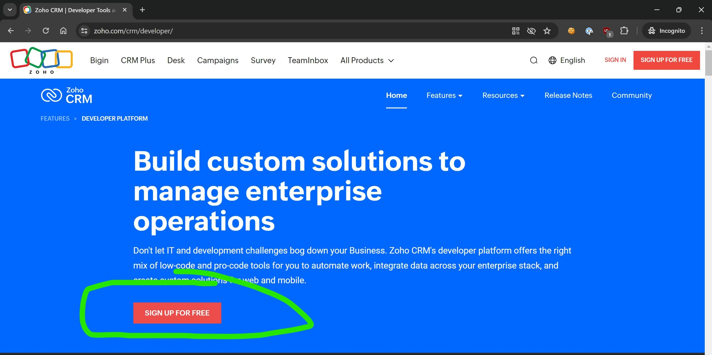
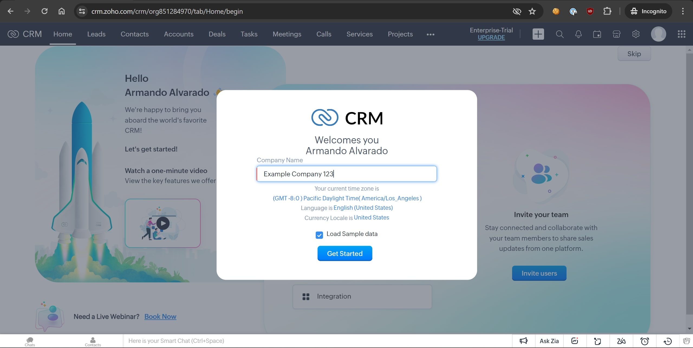
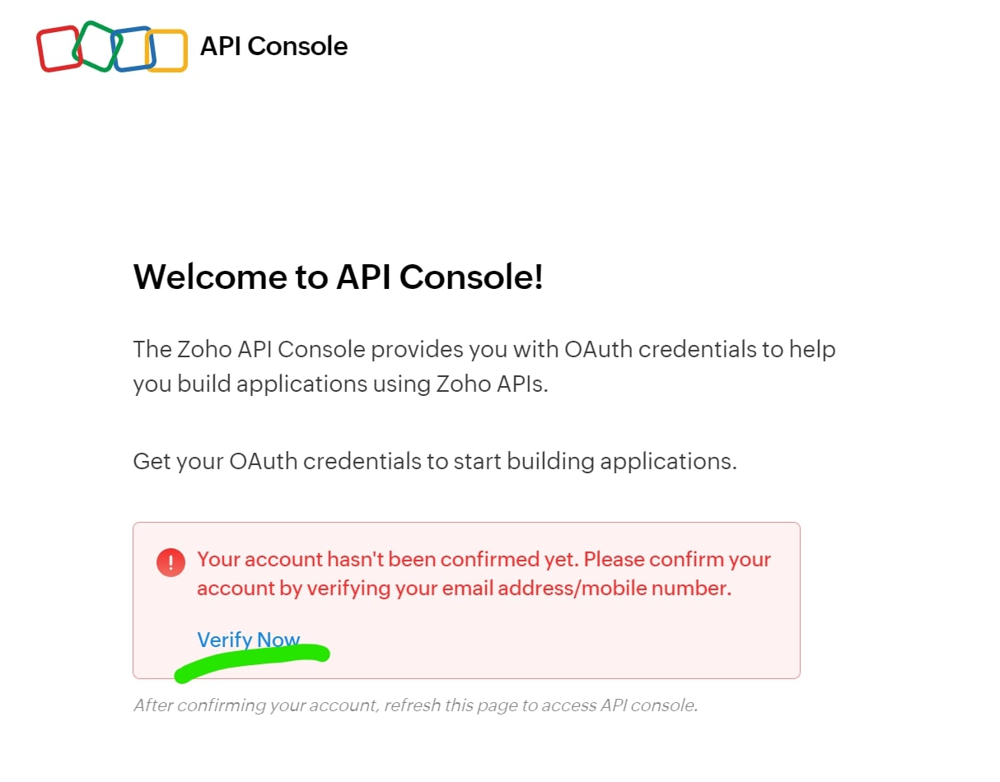
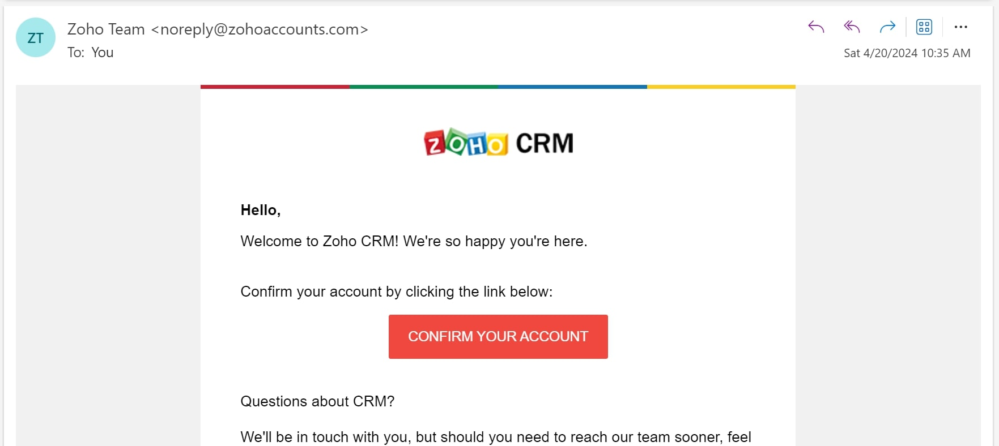
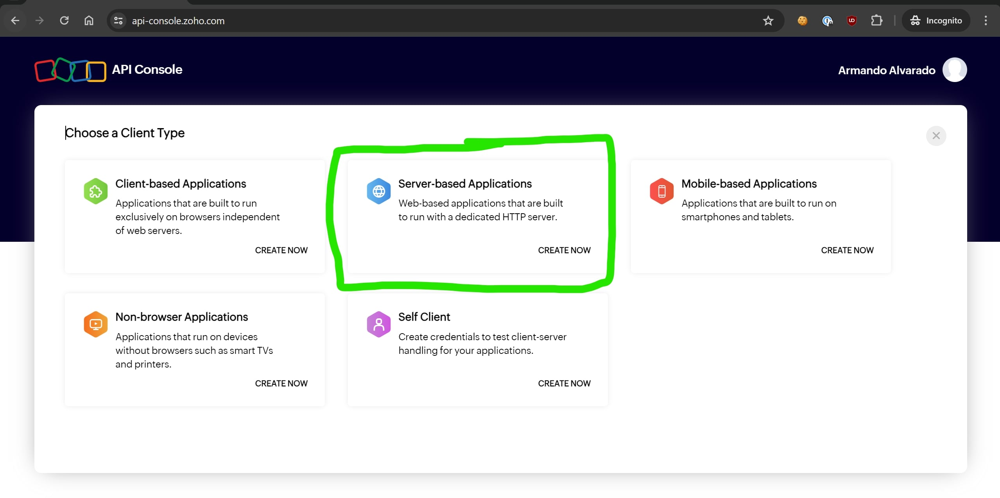
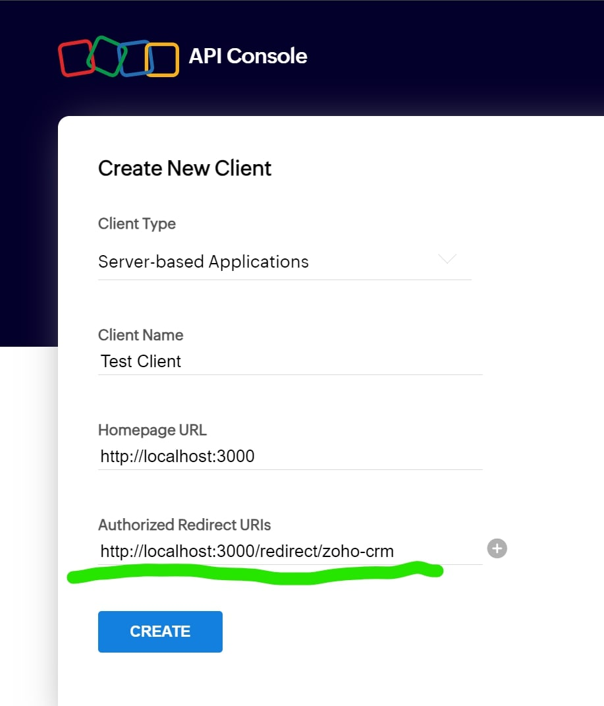
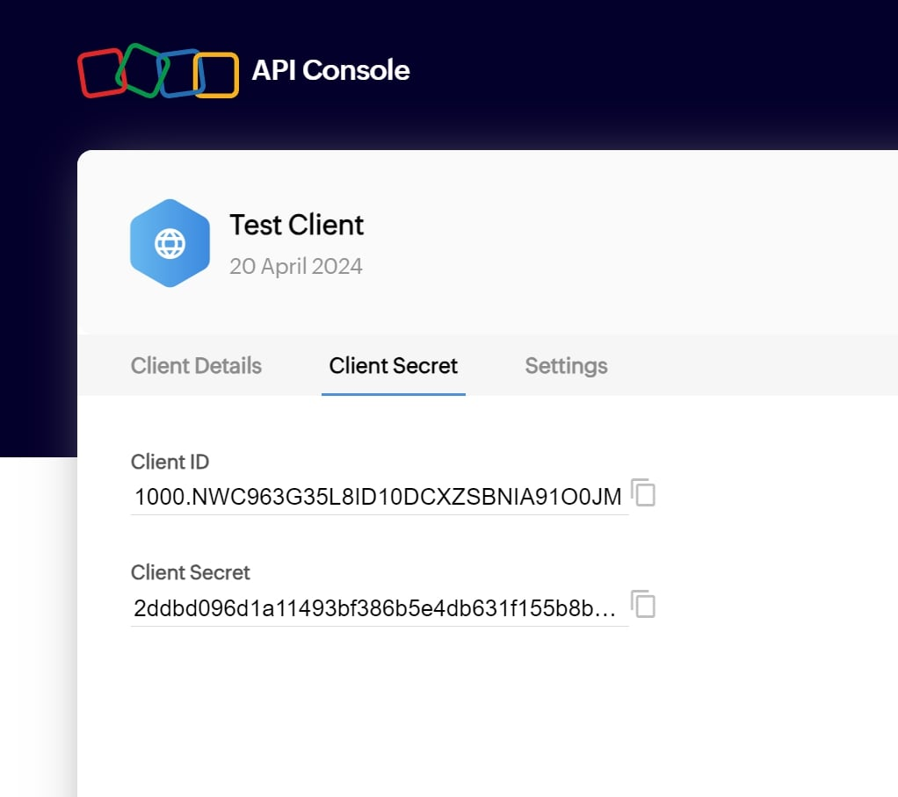
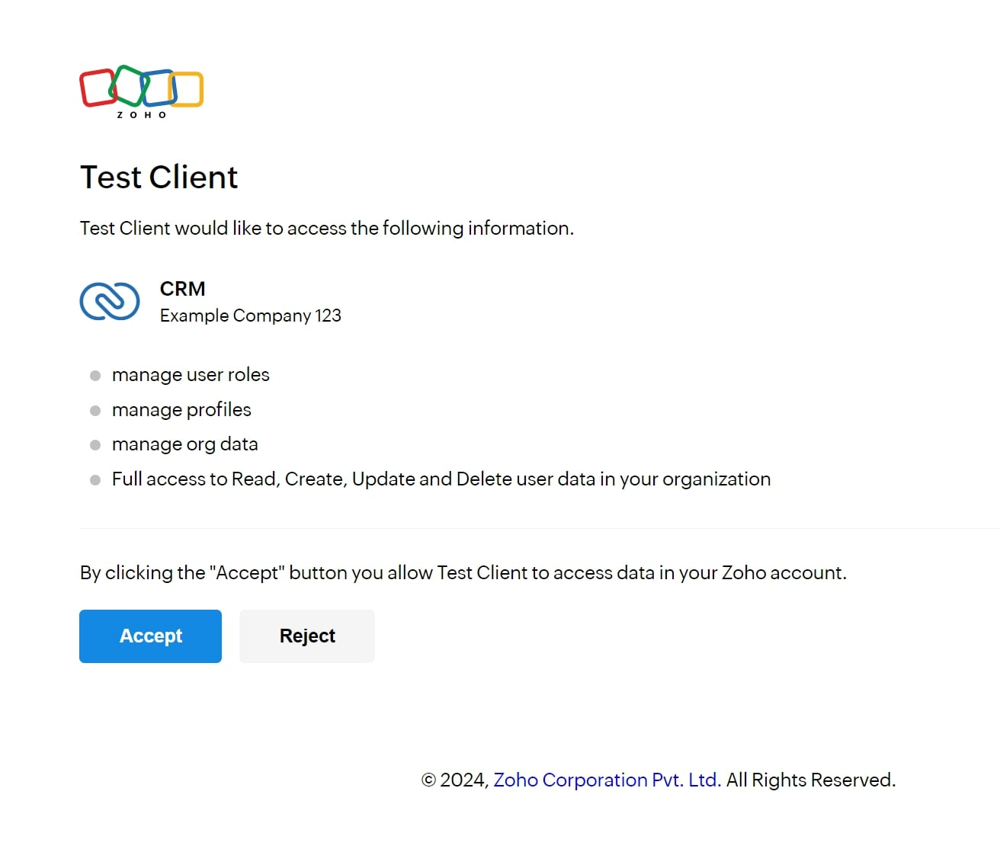
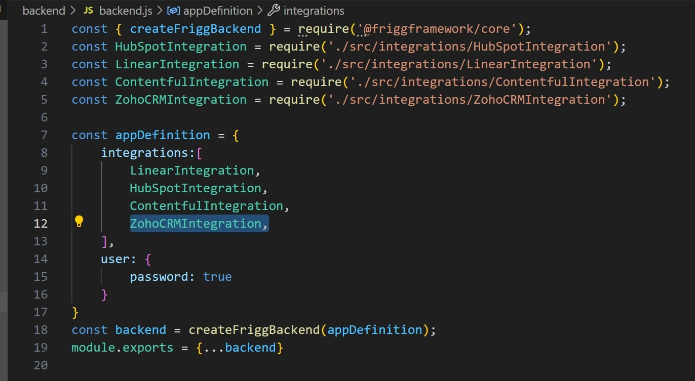
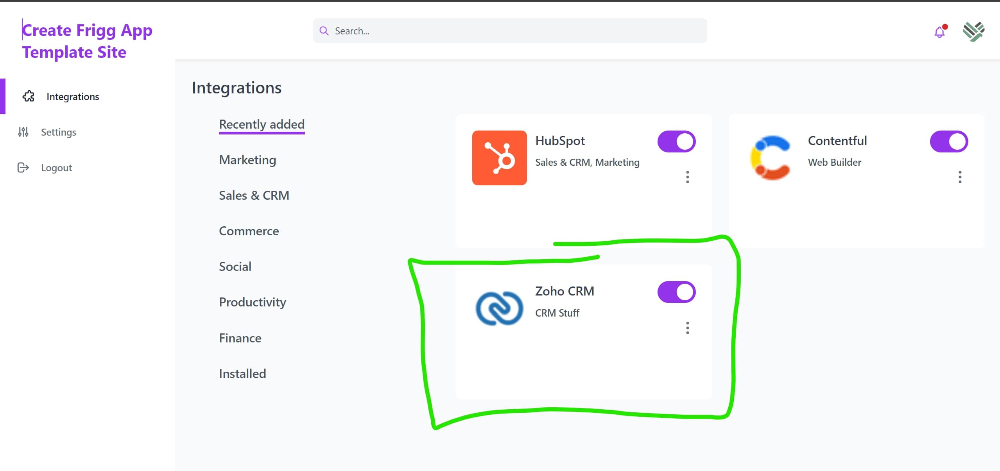

# Zoho CRM API Module

This is the TypeScript API Module for Zoho CRM that allows [Frigg](https://friggframework.org) applications to interact with the Zoho CRM API v8.

**Features:**
- TypeScript with full type definitions
- OAuth 2.0 authentication
- Support for Users, Roles, Profiles, Contacts, Leads, and Accounts resources
- Comprehensive error handling
- Vitest test suite

[Link to the Zoho CRM REST API Postman collection](https://www.postman.com/zohocrmdevelopers/workspace/zoho-crm-developers/collection/8522016-0a15778a-ccb1-4676-98b7-4cf1fe7fc940?ctx=documentation)

Read more on the [Frigg documentation site](https://docs.friggframework.org/api-modules/list/zoho-crm)

## Setup a Zoho CRM Developer Account

To test this API module, you'll need to populate your local `.env` file with credentials (`ZOHO_CRM_CLIENT_ID` and `ZOHO_CRM_CLIENT_SECRET`).

To get these credentials, sign up for a Zoho CRM developer account and [create a new API client](https://www.zoho.com/crm/developer/docs/api/v8/register-client.html).

If you've already done this, skip to the next section.

1. Go to https://www.zoho.com/crm/developer/ and click `Sign Up For Free`


2. Once you're in, set up your example company. Check the `Load Sample Data` box.


3. Go to your account's API Console at https://api-console.zoho.com/

    * You may be asked to verify your email address before accessing your API Console
    

    * You'll receive an email with a verification link
    

4. From your API Console, create a client for your account. Select `Server-based Applications`.


5. When filling in the details for your new client, use `http://localhost:3000/redirect/zoho-crm` in the `Authorized Redirect URIs` field.


6. After creating the client, you'll be sent to the `Client Secret` tab where you can grab your Client ID and Client Secret.


## Set Up Your Local `.env` File

1. Make a copy of `.env.example` and name it `.env`

2. Paste your Client ID and Client Secret from the Zoho CRM API Console into your `.env` file:
    ```shell
    ZOHO_CRM_CLIENT_ID=your_client_id
    ZOHO_CRM_CLIENT_SECRET=your_client_secret
    ZOHO_CRM_SCOPE=ZOHO_CRM_SCOPE=ZohoCRM.org.ALL ZohoCRM.users.ALL ZohoCRM.settings.roles.ALL ZohoCRM.settings.profiles.ALL ZohoCRM.modules.contacts.ALL ZohoCRM.modules.accounts.ALL ZohoCRM.modules.leads.ALL ZohoCRM.notifications.ALL ZohoCRM.modules.notes.ALL ZohoCRM.modules.calls.ALL
    REDIRECT_URI=http://localhost:3000/redirect
    ```

## Available API Resources

### Users
- `listUsers(queryParams)` - List all users with optional filters
- `getUser(userId)` - Get a specific user by ID
- `createUser(body)` - Create a new user
- `updateUser(userId, body)` - Update an existing user
- `deleteUser(userId)` - Delete a user

### Roles
- `listRoles()` - List all roles
- `getRole(roleId)` - Get a specific role by ID
- `createRole(body)` - Create a new role
- `updateRole(roleId, body)` - Update an existing role
- `deleteRole(roleId, queryParams)` - Delete a role

### Profiles
- `listProfiles()` - List all profiles

### Contacts
- `listContacts(queryParams)` - List contacts with optional filters (fields, per_page, page, sort_by, sort_order)
- `getContact(contactId)` - Get a specific contact by ID
- `searchContacts(searchParams)` - Search contacts by email, phone, criteria, or word

### Leads
- `listLeads(queryParams)` - List leads with optional filters (fields, per_page, page, sort_by, sort_order)
- `getLead(leadId)` - Get a specific lead by ID
- `searchLeads(searchParams)` - Search leads by email, phone, criteria, or word

### Accounts
- `listAccounts(queryParams)` - List accounts with optional filters (fields, per_page, page, sort_by, sort_order)
- `getAccount(accountId)` - Get a specific account by ID
- `searchAccounts(searchParams)` - Search accounts by phone, criteria, or word

### Calls
- `logCall(callData)` - Log a call in the Zoho CRM Calls module
- `updateCall(callId, callData)` - Update an existing call record

**Call Data Fields:**
| Field | Type | Required | Description |
|-------|------|----------|-------------|
| `Subject` | string | Yes | Call subject/title |
| `Call_Type` | string | Yes | `Inbound`, `Outbound`, or `Missed` |
| `Call_Start_Time` | string | Yes | ISO 8601 datetime |
| `Call_Duration` | string | Yes* | `mm:ss` format (*required for Inbound/Outbound, cannot be zero) |
| `Description` | string | No | Call notes |
| `Who_Id` | string | No | Contact/Lead ID to associate |
| `$se_module` | string | No | Module for Who_Id: `Contacts` or `Leads` |

## Using the API Module from the Terminal

With your `.env` in place, you can test the API from a Node terminal.

1. Build the module first:
    ```bash
    npm run build
    ```

2. Start a `node` terminal in `packages/v1-ready/zoho-crm`

3. Paste the following code:
    ```js
    require('dotenv').config();
    const {Authenticator} = require('@friggframework/test');
    const {Api} = require('./dist/api.js');

    api = new Api({
        client_id: process.env.ZOHO_CRM_CLIENT_ID,
        client_secret: process.env.ZOHO_CRM_CLIENT_SECRET,
        scope: process.env.ZOHO_CRM_SCOPE,
        redirect_uri: `${process.env.REDIRECT_URI}/zoho-crm`,
    });

    const url = api.getAuthUri();
    const response = await Authenticator.oauth2(url);
    const baseArr = response.base.split('/');
    response.entityType = baseArr[baseArr.length - 1];
    delete response.base;

    await api.getTokenFromCode(response.data.code);

    console.log('api ready!');
    ```

4. Your browser will open and send you to Zoho CRM to authorize the client. You may need to log in first.


5. After authorizing, the tokens are returned to your terminal and used to create an authenticated API instance. You can now call any API method:

    **List Users:**
    ```js
    await api.listUsers()
    ```

    **List Roles:**
    ```js
    await api.listRoles()
    ```

    **List Contacts:**
    ```js
    await api.listContacts({ per_page: 10, fields: 'First_Name,Last_Name,Email' })
    ```

    **Get Contact by ID:**
    ```js
    await api.getContact('contact_id_here')
    ```

    **Search Contacts:**
    ```js
    await api.searchContacts({ email: 'example@email.com' })
    ```

## Using this API Module in a Frigg Application

1. Install the module:
    ```bash
    npm install @friggframework/api-module-zoho-crm
    ```

2. Populate your `.env` file with `ZOHO_CRM_CLIENT_ID`, `ZOHO_CRM_CLIENT_SECRET`, and `ZOHO_CRM_SCOPE`

3. Create a Frigg integration class:
    ```typescript
    import { IntegrationBase } from '@friggframework/core';
    import { Definition as ZohoCRMModule } from '@friggframework/api-module-zoho-crm';

    class ZohoCRMIntegration extends IntegrationBase {
        static Definition = {
            name: 'zohoCrm',
            version: '1.0.0',
            display: {
                name: 'Zoho CRM',
                description: 'Zoho CRM integration for managing contacts, users, and roles',
                category: 'CRM',
            },
            modules: {
                'zohoCrm': ZohoCRMModule
            }
        };

        constructor() {
            super();
            this.events = {
                LIST_CONTACTS: { handler: this.listContacts },
                GET_CONTACT: { handler: this.getContact },
            };
        }

        async listContacts(params) {
            return this.modules['zoho-crm'].api.listContacts(params);
        }

        async getContact(params) {
            return this.modules['zoho-crm'].api.getContact(params.contactId);
        }
    }

    export default ZohoCRMIntegration;
    ```

4. Register your integration in your Frigg app definition's `integrations` array


5. Zoho CRM will appear in your list of available integrations


## Development

### Build
```bash
npm run build
```

### Run Tests
The API tests verify CRUD operations work as expected. You'll need valid credentials in your `.env` file.

```bash
npm test
```

When running tests, a browser tab will open requesting authorization. After authorizing, the tests will run.

**Note:** There is a 240-second timeout for authorization requests.

### Watch Mode
```bash
npm run test:watch
```

## TypeScript Support

This module is written in TypeScript and includes full type definitions. Import types as needed:

```typescript
import { Api, ZohoConfig, ContactsResponse, QueryParams } from '@friggframework/api-module-zoho-crm';
```

## API Version

This module uses **Zoho CRM API v8**. The base URL is `https://www.zohoapis.com/crm/v8`.

## Dependencies

- `@friggframework/core` ^2.0.0-next.16
- `dotenv` ^16.0.0
- `form-data` (for OAuth token exchange)

## License

MIT
